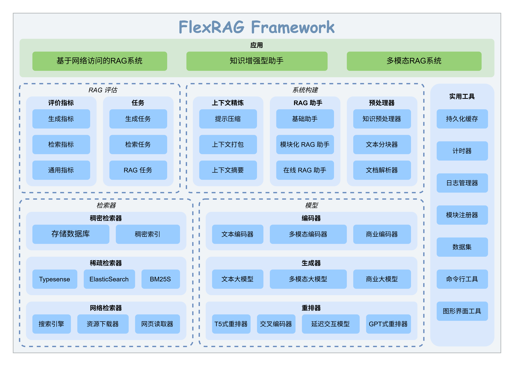

<p align="center">

</p>


[](https://github.com/psf/black)
[](https://pycqa.github.io/isort/)
[](LICENSE)
[](https://flexrag.readthedocs.io/en/latest/)
[](https://flexrag.readthedocs.io/zh-cn/latest/)
[](https://pypi.org/project/flexrag/)
[](https://doi.org/10.5281/zenodo.14306983)

<p align="center">
|
<a href="https://www.bilibili.com/video/BV13rZbYDEHZ"><b>介绍视频</b></a> |
<a href="./README.md"><b>README (english)</b></a> |
<a href="https://flexrag.readthedocs.io/zh-cn/latest/"><b>文档</b></a> |
<a href="https://huggingface.co/collections/ICTNLP/flexrag-retrievers-67b5373b70123669108a2e59"><b>检索器</b></a> |
<a href="https://github.com/ictnlp/FlexRAG_Examples"><b>示例</b></a>
|
</p>

FlexRAG 是一个创新的开源框架，旨在简化 RAG（检索增强生成）系统的快速复现、开发和评估。它全面支持多种 RAG 场景，包括 **基于文本的、多模态的以及可通过 Web 访问的 RAG** 。借助从数据准备到系统评估的**端到端流水线**，FlexRAG 能够帮助研究人员高效地与社区共享他们的工作，并快速基于自己的算法开发演示原型。

# 📖 目录
- [📖 目录](#-目录)
- [✨ 框架特色](#-框架特色)
- [🚀 框架入门](#-框架入门)
- [🏗️ FlexRAG 架构](#️-flexrag-架构)


# ✨ 框架特色
<p align="center">

</p>


# 🚀 框架入门
从 `pip` 安装 FlexRAG:
```bash
pip install flexrag
```

# 🏗️ FlexRAG 架构
FlexRAG 采用**模块化**架构设计，让您可以轻松定制和扩展框架以满足您的特定需求。下图说明了 FlexRAG 的架构：
<p align="center">

</p>


